# Audit FSD du module auth dans gabrielnadoncanada/saas-core-engine

**Je vais utiliser le connecteur GitHub** (unique connecteur activé) **pour récupérer et analyser le dépôt** `gabrielnadoncanada/saas-core-engine`, **puis zoomer sur le chemin** `apps/web/src/features/auth` (le dépôt utilise `src/`, pas `apps/web/features/auth`).

## Sommaire exécutif

Le dépôt **adopte une stratification “FSD pragmatique”** typique d’un projet Next.js App Router : `app/` (routes + handlers), `features/`, `shared/` (et un dossier `server/` pour le code server-only). Cette approche est cohérente avec le fait que FSD **n’oblige pas** à utiliser toutes les couches (`entities`, `widgets`, etc.) et que `processes` est désormais **déconseillée/dépréciée**. citeturn0search0turn1search5turn16search1

Cela dit, **l’implémentation FSD autour de l’auth comporte des écarts structurels importants**, principalement dus à une ambiguïté “slice vs slice-group” et à une violation de dépendances entre couches :

- **MAJEUR — Violation de couche (shared → features)** : `apps/web/src/shared/components/sign-out-dialog.tsx` importe directement `logout` depuis `@/features/auth/lib/auth-client` (donc *Shared* dépend de *Features*). En FSD, les modules d’une couche ne peuvent importer que des couches **strictement en dessous**; *Shared* étant la couche la plus basse, elle ne devrait importer aucune logique “feature”. citeturn0search0turn16search2  
- **MAJEUR — Public API slice manquante** : `apps/web/src/features/auth/` **n’a pas** de `index.ts` racine (slice-level), alors que la règle FSD exige une API publique (souvent via `index.ts`) pour chaque slice. citeturn16search2turn16search3  
- **MOYEN — Structure `features/auth` ambiguë** : `features/auth` contient des segments (`ui/`, `model/`, `lib/`) **et** une sous-arborescence `signup/` qui, elle, ressemble à une slice complète (avec `signup/index.ts`). Ça ressemble à un **slice-group** *et* une slice en même temps, ce qui casse la lisibilité, la règle d’isolation et la règle “pas de code partagé dans un group folder”. citeturn0search1turn16search2  
- **MOYEN — Séparation UI/logic incomplète** : `VerifyEmailGate` fait des `fetch()` directement dans le composant UI (et réimplémente un flux de logout), ce qui va à l’encontre de la séparation par segments (`api`/`model`/`ui`) recommandée par FSD. citeturn0search1turn0search7  

Côté sécurité et flux auth, il y a aussi des points solides : OAuth Google/GitHub utilisent PKCE (`S256`) et des redirects “safe”, ce qui s’aligne avec les recommandations OWASP sur PKCE. citeturn15search7  
Mais **certains éléments critiques restent non vérifiables dans cet audit** (détails des attributs de cookie de session, implémentation du handler `/api/auth/password/reset`) car certains fichiers server sensibles n’ont pas pu être récupérés (restriction d’accès outil).

---

## Méthodologie et périmètre

L’audit est basé sur l’examen statique des fichiers suivants (cœur du périmètre) :

- `apps/web/src/features/auth/**` (login/forgot/reset/verify + sous-module `signup/`)
- Les route pages `apps/web/src/app/(auth)/**` qui consomment ces features
- Les endpoints `apps/web/src/app/api/auth/**` utilisés par `auth-client.ts`
- Les usages transversaux repérés comme violations (ex. `shared/components/sign-out-dialog.tsx`)

Référentiel de comparaison :
- Règles FSD officielles : couches, slices/segments, API publique, règle d’import, slice-groups. citeturn0search0turn0search1turn16search3  
- Contexte Next.js App Router (Server Components par défaut, import de Client Components). citeturn0search8  
- Sécurité (sessions, cookies, reset password, PKCE) via OWASP Cheat Sheets. citeturn15search1turn15search4turn15search7  

Ce qui est **explicitement “non spécifié” / non confirmé** dans ce rapport :
- **Attributs exacts du cookie de session** (HttpOnly/Secure/SameSite/Path/Domain) — recommandés par OWASP citeturn15search1, mais code non accessible ici.
- Détails d’implémentation de `/api/auth/password/reset` — fichier non accessible via extraction.

---

## Analyse structurale et conformité FSD

### Dimension structure de dossiers vs couches FSD

**Constat (plutôt positif)** : Le repo `apps/web/src` suit une structure “FSD minimaliste” plausible pour App Router : `app/` (routes + handlers), `features/`, `shared/`, plus `server/`. La doc FSD précise que vous n’avez pas à utiliser toutes les couches ; la plupart des projets ont au minimum `shared`, `pages`, `app`, mais une adaptation pragmatique est permise. citeturn0search0turn0search2  

**Mais** : dans FSD strict, `pages/` est sa propre couche; ici, `src/app` (Next) joue le rôle hybride “app + pages”. C’est acceptable dans une interprétation “Next-first”, mais ça demande une discipline plus forte pour garder `app/` mince (composition + routing, pas de logique métier). citeturn0search0turn0search8  

### Arborescence actuelle de `features/auth`

Arborescence reconstituée à partir des fichiers observés :

```txt
apps/web/src/features/auth/
  lib/
    auth-client.ts
    index.ts
  model/
    auth-flows.ts
    auth-redirect.ts
    auth-schemas.ts
    index.ts
  ui/
    forgot-password-form.tsx
    login-form.tsx
    reset-password-form.tsx
    verify-email-gate.tsx
    index.ts
  signup/
    api/
      signup-api.ts
      signup-invite-api.ts
    lib/
      signup-payload.ts
      signup-redirect.ts
    model/
      signup-schema.ts
      use-signup-invite.ts
    ui/
      signup-form.tsx
      index.ts
    index.ts
  (manquant)
    index.ts  ← pas d’API publique de slice racine
```

**Sévérité : MAJEUR** (car ça affecte directement l’encapsulation et la capacité à faire évoluer l’arborescence sans casser les imports).

### Tableau “structure actuelle vs structure FSD idéale” (auth)

| Aspect | Actuel | Idéal FSD (recommandé) | Impact |
|---|---|---|---|
| Définition de slice | `features/auth` contient segments + sous-dossier `signup` (quasi-slice) | **Choisir** : soit **slice unique** `auth/` avec `index.ts` racine, soit **slice-group** `auth/` qui contient des slices (`login`, `signup`, `logout`, `password-reset`, `verify-email`) sans code partagé au niveau du groupe citeturn0search1turn16search2 | Évite l’ambiguïté + clarifie l’ownership |
| Public API | `features/auth/index.ts` absent | `features/auth/index.ts` obligatoire (slice) citeturn16search2turn16search3 | Refactors plus sûrs |
| Segments | `ui/`, `model/`, `lib/` + `signup/` | Segments uniformes par slice (`ui`, `model`, `api`, `lib`, `config`) citeturn0search1turn0search0 | Règles d’import plus simples |
| Shared vs Features | `shared/components/sign-out-dialog.tsx` dépend de `features/auth` | Shared ne dépend de rien “feature”; composant doit remonter en `features`/`widgets` ou devenir purement UI avec injection de comportement citeturn0search0turn16search2 | Corrige la violation la plus grave |

---

## Dépendances et encapsulation du module auth

Cette section couvre explicitement :
- **Dimension frontières/encapsulation (API publique, index, re-exports)**
- **Dimension graphe de dépendances & violations cross-layer/circular**

### Dimension encapsulation et API publique

**Constat — API publique incomplète (MAJEUR)**  
FSD exige qu’une slice expose une API publique (souvent via `index.ts`) et que les modules externes ne dépendent pas de la structure interne. citeturn16search2turn16search3  
Ici :
- `features/auth/signup/index.ts` existe et joue correctement le rôle d’API publique (ex. `SignupPage` importe `SignupForm` via `@/features/auth/signup`).  
- Mais `features/auth/` racine **n’a pas** `index.ts`. Donc les pages consomment `@/features/auth/ui` plutôt qu’un contrat stable `@/features/auth` (ou `@/features/auth/login`, etc.).

**Exemples concrets**
- `apps/web/src/app/(auth)/login/page.tsx` :
  ```ts
  import { LoginForm } from "@/features/auth/ui";
  ```
- `apps/web/src/app/(auth)/signup/page.tsx` :
  ```ts
  import { SignupForm } from "@/features/auth/signup";
  ```

**Constat — “Trop d’index” + index mal placé (MINOR à MOYEN)**  
FSD note que multiplier les “barrel files” (index) peut nuire aux perf et qu’il est souvent inutile d’avoir un `index.ts` par segment quand la slice a déjà un `index.ts`. citeturn16search3  
Dans votre cas, vous avez **des index par segment** (`ui/index.ts`, `model/index.ts`, `lib/index.ts`) mais **pas** d’index slice. C’est l’inverse d’un bon compromis.

### Dimension dépendances cross-layer (violations) et imports

**Violation la plus critique (MAJEUR) — Shared → Features**  
Le fichier `apps/web/src/shared/components/sign-out-dialog.tsx` :

```ts
import { logout } from '@/features/auth/lib/auth-client'
```

Ça crée une dépendance “vers le haut” (Shared dépend de Features), ce qui est interdit par la règle d’import des couches (un module ne peut importer que des couches strictement en dessous). citeturn0search0turn16search2  

**Effet secondaire (bug fonctionnel probable)**  
Toujours dans `SignOutDialog`, vous encodez `window.location.href` comme `redirect`. Or votre mécanisme de “safe redirect” (dans `features/auth/model/auth-redirect.ts`) rejette explicitement les entrées contenant `http://` ou `https://` et revient à `"/dashboard"`. Résultat : la promesse “Preserve current location” est contredite par le garde-fou → ça ne redirectera pas vers la page courante comme attendu.

**Incohérence structurelle (MOYEN) — `signup` dépend de `auth/lib`**  
`apps/web/src/features/auth/signup/api/signup-api.ts` importe `signup` via `@/features/auth/lib`. Si `auth/` est une slice-group, **ce partage de code est interdit**; si `auth/` est une slice, alors `signup/` n’est pas une slice “pair” mais un sous-module interne… sauf qu’il a son propre `index.ts` et ses segments, ce qui ressemble à une slice complète.

**Import locality (MOYEN)**  
FSD recommande : imports **relatifs** à l’intérieur d’une même slice; imports **absolus** entre slices via API publique. citeturn16search3turn16search2  
Or plusieurs imports internes à la slice utilisent `@/features/...` (alias absolu) au lieu de `../...` (ex. `auth-flows.ts`, `use-signup-invite.ts`). Ça ne casse pas le build, mais ça :
- rend plus difficile l’application automatique des règles FSD (linter)
- augmente le risque de “deep import” involontaire inter-slices

### Visualisation (mermaid) du graphe de dépendances

```mermaid
graph TD
  %% --- App Router pages ---
  LoginPage["app/(auth)/login/page.tsx"]
  SignupPage["app/(auth)/signup/page.tsx"]
  ForgotPage["app/(auth)/forgot-password/page.tsx"]
  ResetPage["app/(auth)/reset-password/page.tsx"]
  VerifyEmailPage["app/(auth)/verify-email/page.tsx"]

  %% --- Feature: auth (current) ---
  AuthUI["features/auth/ui/index.ts"]
  LoginForm["features/auth/ui/login-form.tsx"]
  ForgotForm["features/auth/ui/forgot-password-form.tsx"]
  ResetForm["features/auth/ui/reset-password-form.tsx"]
  VerifyGate["features/auth/ui/verify-email-gate.tsx"]

  AuthModel["features/auth/model/index.ts"]
  AuthFlows["features/auth/model/auth-flows.ts"]
  AuthRedirect["features/auth/model/auth-redirect.ts"]
  AuthSchemas["features/auth/model/auth-schemas.ts"]

  AuthLib["features/auth/lib/index.ts"]
  AuthClient["features/auth/lib/auth-client.ts"]

  %% --- Feature: signup (nested) ---
  SignupIndex["features/auth/signup/index.ts"]
  SignupForm["features/auth/signup/ui/signup-form.tsx"]
  SignupApi["features/auth/signup/api/signup-api.ts"]
  SignupInviteApi["features/auth/signup/api/signup-invite-api.ts"]
  SignupPayload["features/auth/signup/lib/signup-payload.ts"]
  SignupRedirect["features/auth/signup/lib/signup-redirect.ts"]
  SignupSchema["features/auth/signup/model/signup-schema.ts"]
  UseSignupInvite["features/auth/signup/model/use-signup-invite.ts"]

  %% --- Shared (current) ---
  AuthCard["shared/components/auth/auth-card"]
  SharedUI["shared/components/ui/*"]
  Routes["shared/constants/routes.ts"]
  SignOutDialog["shared/components/sign-out-dialog.tsx"]

  %% --- Server side auth context ---
  RequireUser["server/auth/require-user.ts"]
  ApiLogin["app/api/auth/login/route.ts"]
  ApiSignup["app/api/auth/signup/route.ts"]
  ApiLogout["app/api/auth/logout/route.ts"]
  ApiVerifyReq["app/api/auth/verify-email/request/route.ts"]
  ApiOAuthStart["app/api/auth/oauth/*/start/route.ts"]

  %% Page composition
  LoginPage --> AuthCard
  LoginPage --> AuthUI
  SignupPage --> AuthCard
  SignupPage --> SignupIndex
  ForgotPage --> AuthCard
  ForgotPage --> AuthUI
  ResetPage --> AuthCard
  ResetPage --> AuthUI
  VerifyEmailPage --> AuthCard
  VerifyEmailPage --> AuthUI
  VerifyEmailPage --> RequireUser

  %% Auth UI -> model
  AuthUI --> LoginForm
  AuthUI --> ForgotForm
  AuthUI --> ResetForm
  AuthUI --> VerifyGate
  LoginForm --> AuthModel
  ForgotForm --> AuthModel
  ResetForm --> AuthModel

  %% Model -> lib -> http
  AuthModel --> AuthFlows
  AuthModel --> AuthRedirect
  AuthModel --> AuthSchemas
  AuthFlows --> AuthLib
  AuthLib --> AuthClient

  %% Signup slice internals
  SignupIndex --> SignupForm
  SignupForm --> SignupApi
  SignupForm --> SignupInviteApi
  SignupForm --> SignupPayload
  SignupForm --> SignupRedirect
  SignupForm --> SignupSchema
  SignupForm --> UseSignupInvite
  UseSignupInvite --> SignupInviteApi
  SignupApi --> AuthLib

  %% Shared violation
  SignOutDialog --> AuthClient
  SignOutDialog --> Routes
```



**Point à retenir** : la flèche `shared/components/sign-out-dialog.tsx → features/auth/lib/auth-client.ts` est **une violation FSD** (Shared ne doit pas importer Features). citeturn0search0turn16search2  

---

## État, tests, build/runtime et sécurité

Cette section couvre explicitement :
- **Dimension state management & data flow**
- **Dimension séparation UI vs logique**
- **Dimension tests & documentation**
- **Dimension build/runtime**
- **Dimension sécurité & auth flows**

### Dimension état et data flow (où vit l’état “auth”)

**Constat (plutôt solide) — Auth state côté serveur, session via cookie**  
Le flux est clairement orienté “server session” :
- Le login côté UI appelle `loginWithPassword()` puis redirige (pas de store global client).
- Le serveur crée une session via `createSessionService().createSession(...)` et place un cookie (via `setSessionCookie(...)`) dans `/api/auth/login`.
- Les pages server-side peuvent exiger un utilisateur via `requireUser()` qui appelle `getSessionTokenFromCookie()` puis `SessionContextService.resolve(...)`.

Ça positionne “l’état auth” comme **état serveur** (résolu à la demande), ce qui est souvent un bon fit pour Next App Router.

**Ce qui manque (à décider, pas forcément une erreur)**  
Il n’y a pas de `entities/user` ou `entities/session` côté frontend. En “FSD pages-first” (v2.1), c’est acceptable tant que la complexité ne justifie pas l’introduction d’Entities. citeturn16search4  

### Dimension séparation UI vs logique

**Bien fait (MINOR – positif)**  
Les formulaires login/forgot/reset utilisent une séparation raisonnable :
- schémas Zod dans `model/auth-schemas.ts`
- orchestration “flows” dans `model/auth-flows.ts`
- appels HTTP dans `lib/auth-client.ts`
- UI dans `ui/*.tsx`

Ça correspond exactement à l’intention segments (`ui`/`model`/`api|lib`) décrite par FSD. citeturn0search1turn0search7  

**À corriger (MOYEN)**  
`features/auth/ui/verify-email-gate.tsx` effectue des `fetch()` directement dans le composant UI (resend + logout). En FSD, les interactions backend devraient vivre dans un segment `api` (ou au minimum hors UI), pour garder l’UI centrée sur l’affichage et le binding. citeturn0search1turn0search7  

### Dimension tests et documentation (couverture)

**Tests (plutôt solides côté routes)**  
On observe :
- Playwright E2E `apps/web/e2e/auth.e2e.spec.ts` (signup→verify→login→dashboard; reset password; logout).  
- Vitest unit tests pour endpoints (ex. `/api/auth/login`).

**Limite** : pas de tests unitaires/UI directs pour `features/auth/ui/*` (ce qui peut rester acceptable si vous couvrez les flux via E2E + tests de routes).

**Documentation**  
Le README décrit clairement l’architecture “packages core + apps/web adapter layer” et les flux auth (password reset, OAuth PKCE). Côté FSD, la doc officielle recommande aussi des outils comme Steiger pour faire respecter API publique et règles de couches. citeturn16search3turn16search0  

### Dimension build/runtime (lazy loading, chunking, tree-shaking)

**Chunking / RSC**  
En App Router, les pages sont Server Components par défaut et importent des Client Components (vos formulaires `use client`), ce qui est le pattern standard. citeturn0search8  

**Barrel files**  
FSD note que les index files sont utiles comme API publique, mais peuvent aussi créer du coût (dev server) et, surtout, que des index “par segment” sont souvent inutiles si la slice a déjà son `index.ts`. citeturn16search3  
Dans votre cas, vous avez plusieurs index de segments mais pas d’index racine → le coût sans le bénéfice principal.

**Bundling server libs vers client (attention maîtrisée)**  
`features/auth/model/auth-redirect.ts` mentionne explicitement un choix pour éviter d’embarquer des dépendances server (ex. argon2/node-gyp via `@auth-core`) dans le bundle client. C’est un signal positif : vous surveillez le boundary client/server.

### Dimension sécurité (tokens, cookies, reset, OAuth, responsabilités server/client)

**Forces observées**
- **OAuth PKCE** : vos routes OAuth “start” construisent un `code_challenge` S256 (PKCE) — très aligné avec OWASP (PKCE réduit l’interception du code d’autorisation). citeturn15search7  
- **Anti-enumeration** : le flux “forgot password” côté UX renvoie un message générique “If the email exists…” et côté serveur, le handler peut répondre `ok` même si l’email n’est pas fourni (pattern recommandé pour éviter l’énumération d’utilisateurs). citeturn15search4  
- **Rate limiting** : `enforceAuthRateLimit` est appliqué sur plusieurs routes sensibles (login, signup, oauth_start, password_forgot, verify_email_request), ce qui est un vrai plus pour réduire brute force/abuse.

**Zones à risque / incertitudes (à clarifier)**
- **Cookies de session** : OWASP recommande fortement `Secure`, `HttpOnly` et un `SameSite` approprié pour les cookies de session. citeturn15search1  
  → Ici, puisque le fichier responsable de la gestion cookie n’était pas accessible dans cet audit, **c’est non confirmé**.  
- **CSRF** : avec auth via cookies, les endpoints POST (logout, profile update, etc.) ont besoin d’une politique “SameSite/Origin check/CSRF token” cohérente. Sans visibilité sur les attributs cookie + headers, **c’est non spécifié**.  
- **Reset password** : OWASP recommande des tokens de reset aléatoires, longs, à usage unique, stockés de façon sécurisée et expirant rapidement. citeturn15search4  
  → Votre système semble aller dans ce sens (tokens + TTL), mais le handler `/api/auth/password/reset` n’a pas pu être audité ici → **non confirmé**.  
- **Hashage mots de passe** : OWASP recommande Argon2id (ou scrypt/PBKDF2) avec paramètres minimaux. citeturn15search0  
  → Vous utilisez `hashPassword` côté serveur, mais l’algo/paramétrage exact n’est pas visible dans ce périmètre.

---

## Recommandations priorisées et checklist

### Recommandations (triées par impact / effort)

#### Correctifs immédiats

**Supprimer la dépendance Shared → Features (MAJEUR | impact très élevé | effort moyen)**  
Vous devez éliminer `shared/components/sign-out-dialog.tsx` → `features/auth/*`. Deux options viables :

Option A (rapide, “FSD-safe”) : **déplacer les appels auth HTTP dans `shared/api/auth`**, puis faire pointer Features *et* Shared vers `shared/api`.  
- Avantage : corrige la violation sans créer `widgets/` tout de suite.  
- Inconvénient : `shared/api` contiendra du code “auth-domain”, ce qui peut être acceptable (FSD décrit `shared/api` comme zone de connexion backend), mais c’est un choix architectural à assumer. citeturn0search0  

Option B (plus “pur FSD”) : **monter `SignOutDialog` dans une feature** (`features/auth/logout`) ou un widget (`widgets/nav-user`) et garder Shared strictement UI.  
- Avantage : Shared reste propre.  
- Inconvénient : effort structurel plus élevé (introduire `widgets/` ou bouger `nav-user`).

**Patch minimal (Option A) – exemple de diff**
```diff
- // apps/web/src/shared/components/sign-out-dialog.tsx
- import { logout } from '@/features/auth/lib/auth-client'
+ // apps/web/src/shared/components/sign-out-dialog.tsx
+ import { logout } from '@/shared/api/auth'

  // ...
- const currentPath = window.location.href
+ const currentPath = `${window.location.pathname}${window.location.search}${window.location.hash}`
  router.push(`${routes.auth.login}?redirect=${encodeURIComponent(currentPath)}`)
```

Et créer `apps/web/src/shared/api/auth.ts` en y déplaçant `logout()` (et potentiellement le reste du client auth si vous voulez éliminer la duplication).

---

**Ajouter une API publique de slice `features/auth/index.ts` (MAJEUR | impact élevé | effort faible)**  
FSD impose une API publique par slice. citeturn16search2turn16search3  
Ajoutez :

```ts
// apps/web/src/features/auth/index.ts
export { LoginForm, ForgotPasswordForm, ResetPasswordForm, VerifyEmailGate } from "./ui";
export {
  loginWithPassword,
  sendPasswordResetLink,
  resetUserPassword,
  getDashboardRedirectPath,
  getOAuthStartUrl,
  loginFormSchema,
  forgotPasswordFormSchema,
  resetPasswordFormSchema,
  DEMO_CREDENTIALS,
  type LoginFormValues,
  type ForgotPasswordValues,
  type ResetPasswordValues,
} from "./model";
export { SignupForm } from "./signup"; // ou export explicite des éléments nécessaires
```

Puis migrer progressivement les imports externes (pages/app/widgets) vers `@/features/auth` au lieu de `@/features/auth/ui` ou `@/features/auth/model`.

---

**Sortir les `fetch()` de `VerifyEmailGate` (MOYEN | impact moyen | effort faible)**  
Créer un petit module dans `features/auth` (idéalement `api/verify-email.ts` ou `lib/auth-client.ts` si vous gardez la convention actuelle) et remplacer les fetch inline. Ça renforce la séparation par segments. citeturn0search1turn0search7  

---

#### Améliorations structurantes

**Clarifier “auth = slice” vs “auth = slice-group” (MOYEN | impact élevé | effort moyen)**  
Actuellement, `features/auth` est ambivalent. FSD autorise les slice-groups mais **sans code partagé** dans le dossier group. citeturn0search1turn16search2  

Deux trajectoires :

- Trajectoire 1 : **Auth comme slice unique**  
  Garder `features/auth/{ui,model,api,lib}` et convertir `signup/` en simple sous-dossier interne, *sans* prétendre être une slice séparée (ou au minimum considérer `signup` comme “module interne”, pas “slice indépendante”).  
  → Simple, mais `auth` deviendra “grosse feature”.

- Trajectoire 2 (souvent meilleure à moyen terme) : **Auth comme slice-group**  
  `features/auth/login`, `features/auth/signup`, `features/auth/logout`, `features/auth/password-reset`, `features/auth/verify-email`  
  Chaque slice a `index.ts` et segments. Aucun module partagé dans `features/auth/` au niveau group. Si vous avez du code commun (safe redirect, api client), il va dans `shared/*` ou chaque slice.

---

**Installer un linter d’architecture FSD (MOYEN | impact élevé | effort faible-moyen)**  
FSD recommande Steiger pour attraper automatiquement :
- absence d’API publique
- violations de couches
- import-locality  
citeturn16search0turn16search3  

Exemple de mise en place minimale :
- `npm i -D steiger @feature-sliced/steiger-plugin`
- config `steiger.config.js` + CI `npx steiger ./apps/web/src`

---

### Prochaines étapes suggérées

1. **Décision d’architecture** : trancher si `auth` doit être une slice unique ou une slice-group (c’est le point qui conditionne tout le refactor propre).
2. **Corriger la violation Shared → Features** (priorité #1).
3. **Standardiser l’API publique** (`features/auth/index.ts`) et migrer les imports externes.
4. **Appliquer Steiger** pour empêcher la réintroduction des violations. citeturn16search0  
5. **Sécurité** : vérifier (et documenter) les attributs cookie de session selon OWASP (Secure/HttpOnly/SameSite). citeturn15search1  

### Checklist courte (développeurs)

- [ ] `shared/**` n’importe plus aucun module `features/**` (règle de couche respectée). citeturn0search0turn16search2  
- [ ] `apps/web/src/features/auth/index.ts` existe et sert d’entrée publique (API publique). citeturn16search2turn16search3  
- [ ] Imports inter-slices passent par l’API publique; imports intra-slice sont relatifs. citeturn16search2turn16search3  
- [ ] `VerifyEmailGate` n’a plus de `fetch()` inline (déplacé en `api/` ou équivalent). citeturn0search1  
- [ ] Steiger tourne en CI et bloque les regressions d’architecture. citeturn16search0  
- [ ] Attributs cookie de session validés vs recommandations OWASP (Secure/HttpOnly/SameSite) et documentés. citeturn15search1