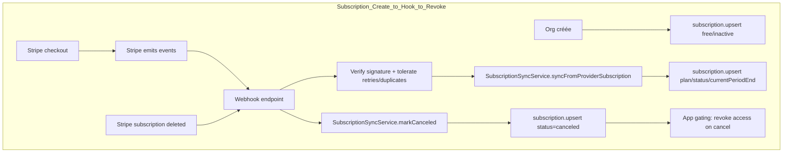

# Audit production-ready de `packages/org-core` dans `gabrielnadoncanada/saas-core-engine`

## Résumé exécutif

J’ai audité `packages/org-core` et tout ce qui l’entoure (docs produit, DB Prisma, adapter Next, routes org et intégration billing). Le package couvre un **MVP org/teams** (création d’org en transaction avec membership owner + subscription initiale, invitations à durée limitée par token haché, acceptation en transaction) et s’aligne partiellement sur la vision “SaaS B2B production-ready en <7 jours”. Toutefois, il y a une **non-conformité majeure au PRD**: la fonctionnalité **Switch org** est marquée “✅” dans le PRD, mais l’endpoint `/api/org/switch` est explicitement **non implémenté** (“Not implemented in V1”). De plus, l’implémentation autorise déjà de facto des états **multi-org par user** (création d’org illimitée, acceptation d’invites), sans mécanisme de sélection d’org active, ce qui crée des incohérences UX/produit et des risques d’ops. Finalement, `@org-core` n’a **aucun script de tests**, ce qui signifie très probablement que `turbo test` ne l’exécute pas en CI, et qu’on ne peut pas qualifier “prod-ready” sans filet. Verdict: **prod-ready = non** à ce stade.

**État prod-ready:** **non**  
**Score maturité (0–100): 66 / 100**  
Critères utilisés (pondération qualitative): alignement PRD/Vision (20), invariants multi-tenant + access control (25), intégrité DB/transactions (20), DX/abstractions (10), tests & CI/CD (25).

## Étapes effectuées, fichiers lus et heuristiques

### Connecteurs activés

GitHub (liste complète fournie: `github`).

### Appels GitHub effectués via `api_tool` (résumé)

J’ai utilisé le connecteur GitHub via `api_tool` avec les catégories suivantes, dans l’ordre:
- `search_installed_repositories_v2` (validation du dépôt installé et de la branche par défaut).
- `fetch_file` (tentatives initiales sur `creation__docs/PRD.md` et `creation__docs/Vision.md`, retournant 404 car les fichiers sont en minuscules).
- `fetch` (lecture du contenu exact des fichiers via URLs `github.com/.../raw/...`):
  - docs `creation__docs/prd.md`, `creation__docs/vision.md`
  - code `packages/org-core/src/*`
  - schéma Prisma `packages/db/prisma/schema.prisma` et tx runner `packages/db/src/tx.ts`
  - repos Prisma côté app `apps/web/src/server/db-repos/*`
  - adapter org-core `apps/web/src/server/adapters/core/org-core.adapter.ts`
  - routes org `apps/web/src/app/api/org/*`
  - page team `apps/web/src/app/(app)/dashboard/team/page.tsx`
  - scripts racines `package.json`, `turbo.json`.

### Fichiers lus (paths exacts)

Docs produit (demandés dans `creation__docs`):
- `creation__docs/prd.md`
- `creation__docs/vision.md`

Org-core:
- `packages/org-core/package.json`
- `packages/org-core/src/index.ts`
- `packages/org-core/src/org.ports.ts`
- `packages/org-core/src/org.service.ts`
- `packages/org-core/src/membership.service.ts`
- `packages/org-core/src/invite.service.ts`

DB & transactions:
- `packages/db/prisma/schema.prisma`
- `packages/db/src/tx.ts`

Adapteurs & app (pour vérifier l’“end-to-end reality”):
- `apps/web/src/server/adapters/core/org-core.adapter.ts`
- `apps/web/src/server/db-repos/orgs.repo.ts`
- `apps/web/src/server/db-repos/memberships.repo.ts`
- `apps/web/src/server/db-repos/invitations.repo.ts`
- `apps/web/src/server/db-repos/subscriptions.repo.ts`
- `apps/web/src/server/db-repos/users.repo.ts`
- `apps/web/src/server/auth/require-org.ts`
- `apps/web/src/app/api/org/create/route.ts`
- `apps/web/src/app/api/org/invite/route.ts`
- `apps/web/src/app/api/org/invite/accept/route.ts`
- `apps/web/src/app/api/org/switch/route.ts`
- `apps/web/src/app/(app)/dashboard/team/page.tsx`

Billing (pour le flow “subscription create → webhook sync → revoke” demandé):
- `packages/billing-core/src/subscription/subscription.sync.ts`
- `packages/billing-core/src/subscription/plans.ts`
- `packages/contracts/src/billing.ts`

Contrats org:
- `packages/contracts/src/org.ts`

### Heuristiques utilisées

J’ai évalué:
- l’**alignement strict** PRD/Vision vs implémentation (features “✅” vs endpoints/services réellement présents),
- les invariants multi-tenant (org active, membership, isolation) et la **centralisation des checks** d’autorisations (risque “checks dispersés”),
- l’intégrité DB (contraintes `@unique`, `@@unique`, index, relations) et l’usage du `TxRunner`,
- l’idempotence/race conditions (invites acceptées en parallèle, créations concurrentes),
- la capacité à être opérée en prod (erreurs typées, logs/audit, tests/CI).

Limite importante: je ne fournis pas de citations “filecite” (outil indisponible ici pour GitHub). J’appuie donc les constats repo par **chemins + extraits** issus du connecteur GitHub. Les recommandations normatives (OWASP/Stripe) sont citées via sources web.

## Alignement produit vs PRD/Vision

### Ce que le PRD et la Vision exigent

Le PRD V1 stipule explicitement le scope “Organization & Multi-Tenancy” incluant **Create org**, **Switch org**, **Invite**, **Accept invite**, rôles fixes owner/admin/member et isolement serveur. Il affirme aussi “Default org auto-created at signup”. (Source: `creation__docs/prd.md`, sections 4.2 et 6.)

La Vision renforce la même direction: “Create organization”, “Switch organization”, “Invite members”, “Role assignment”, “Org-scoped data isolation”, et positionne ces modules comme fondamentaux. (Source: `creation__docs/vision.md`, sections Multi-tenant / RBAC / Billing.)

### Écarts critiques observés

Le PRD marque **Switch org ✅**, mais l’endpoint correspondant renvoie 501 avec un commentaire “V1: not implemented (single org default)” dans `apps/web/src/app/api/org/switch/route.ts`. C’est une contradiction produit/implémentation.

Deuxième tension: le PRD dit “Multi-org per user (V2)”, mais le schéma Prisma autorise clairement plusieurs `Membership` par `User` (unicité seulement sur `[userId, organizationId]`), `OrgService.createOrg` ne limite pas le nombre d’orgs par user, et `InviteService.acceptInvite` peut ajouter une membership à un autre org. Résultat: **multi-org techniquement possible**, mais **non sélectionnable** (puisque `getDefaultOrgIdForUser()` retourne le premier membership par `createdAt`). 

Ce conflit n’est pas juste “documentation”: il crée un état où:
- un user peut accepter une invite vers une 2e org,
- mais l’app continue de le “scoper” à sa première org,
- et `/api/org/switch` est non implémenté → l’utilisateur est coincé.

## Audit technique par dimension

### Fonctionnalités `org-core`

Ce que `@org-core` expose réellement (`packages/org-core/src/index.ts`):
- `OrgService.createOrg()` (tx) qui crée org + membership owner + subscription free inactive (`packages/org-core/src/org.service.ts`).
- `MembershipService.requireOrgRole()` et `listOrgMembers()` (`packages/org-core/src/membership.service.ts`).
- `InviteService.createInvite()`, `acceptInvite()` (tx) et `listPendingInvites()` (`packages/org-core/src/invite.service.ts`).

Ce qui manque par rapport aux besoins “team management” réalistes:
- opérations admin (changer rôle, retirer membre, transférer ownership),
- invariant “dernier owner” (ne pas se locked-out),
- org management (rename/delete),
- switch org (absent côté core; et endpoint non implémenté côté app).

### DB integrity & transactions

Points forts:
- `Membership` a `@@unique([userId, organizationId])`: robustesse contre doublons.
- `Invitation.tokenHash` est `@unique`: un token hash correspond à une seule invite.
- `Subscription.organizationId` est `@unique`: 1 subscription par org.
- `OrgService.createOrg` et `InviteService.acceptInvite` sont transactionnels via `TxRunner` (dans core) et `withTx` Prisma (dans db).  

Le `tx runner` global est simple et correct: `prisma.$transaction((tx) => fn(tx))` (`packages/db/src/tx.ts`).

Angle mort principal: **race conditions** sur accept invite. Le flow fait “check existing membership puis create membership”. Deux acceptations simultanées du même token peuvent toutes deux voir “existing = null” et une des transactions va échouer sur l’unicité `[userId, organizationId]`. Ce n’est pas une faille de sécurité, mais c’est un bug UX/ops (l’utilisateur peut voir “failed” tout en étant effectivement membre).

### Security & access control

Le check de rôle est fourni par `MembershipService.requireOrgRole`, mais il lance `new Error("FORBIDDEN")` (pas d’erreur typée) et, surtout, le check “owner/admin pour inviter” est fait **dans la route** `apps/web/src/app/api/org/invite/route.ts`, pas dans `InviteService.createInvite()`.

OWASP recommande explicitement de **valider les permissions à chaque requête** et de vérifier que les checks sont effectués “au bon endroit” (sinon un seul endpoint oublié suffit à ouvrir l’accès), et de tester l’autorisation. citeturn4search0

Conséquence immédiate dans votre architecture “core + adapters”: si un futur adapter (cron/admin route/CLI) appelle `InviteService.createInvite()` sans appliquer `requireOrgRole`, il peut créer des invites sans autorisation.

Aucun audit log org n’existe (ni table dédiée). OWASP recommande de loguer au minimum les échecs de contrôle d’accès (authorization failures) et d’autres événements de sécurité. citeturn4search2

### DX/abstractions

`org.ports.ts` définit des ports minimaux (OrgsRepo, MembershipsRepo, InvitationsRepo, SubscriptionsRepo, UsersRepo, TxRunner, InviteToken). C’est bien pour garder `@org-core` agnostique. Toutefois:
- les signatures utilisent `tx?: any` partout: perte de type-safety et propagation d’`any`.
- `InviteService.createInvite` accepte `inviterUserId` mais ne l’utilise pas → signe clair d’un check manquant.

Côté app, l’adapter `org-core.adapter.ts` crée un token base64url 32 bytes et le hash avec `hashToken(rawToken, env.TOKEN_PEPPER)` (bonne réutilisation du hashing auth) et injecte `withTx` comme `TxRunner`.

### Tests, CI/CD & release

Le racine exécute `turbo test` via le script `test` (`package.json`, `turbo.json`). Or `packages/org-core/package.json` ne déclare aucun script `test`. Cela rend très probable que `@org-core` n’est **pas testé en CI**.

Les workflows GitHub Actions, scans deps/SAST et changelog ne sont pas confirmés dans ce contexte → **non spécifié**.

## Tableau des manquants/risques et corrections proposées

| Composant/fichier (path) | Problème précis | Impact (sécurité/UX/ops) | Priorité | Effort | Patch suggéré (pseudo/snippet) | Tests à ajouter |
|---|---|---|---|---|---|---|
| `creation__docs/prd.md` + `creation__docs/vision.md` | Contradiction produit: “Switch org ✅” mais “Multi-org per user (V2)” alors que le système autorise multi-org sans switch | UX/produit/ops | P0 | Petit | Clarifier la règle V1: **Option A** “single-org strict” (bloquer création/acception supplémentaires) ou **Option B** “multi-org + switch V1” (implémenter switch et org active) | Test doc (CI): PRD/Vision contiennent invariants explicités |
| `apps/web/src/app/api/org/switch/route.ts` + `apps/web/src/server/auth/require-org.ts` | Switch org non implémenté; `getDefaultOrgIdForUser()` retourne le 1er membership | UX/produit | P0 | Moyen | **Option B recommandée**: ajouter `activeOrganizationId` (User ou Session), implémenter `POST /api/org/switch` qui vérifie membership puis update préférences; modifier `getDefaultOrgIdForUser` → `getActiveOrgIdForUser` | E2E: user 2 orgs → switch change orgId utilisé; intégration: refuse switch si pas membre |
| `packages/org-core/package.json` | Aucun script `test` → `turbo test` ne couvre pas org-core | ops/qualité | P0 | Petit | Ajouter `vitest` + scripts: `"test":"vitest run"`, `"test:watch":"vitest"`; config TypeScript | CI: `pnpm -r test` exécute org-core |
| `packages/org-core/src/membership.service.ts` | `requireOrgRole` lance `Error("FORBIDDEN")`, pas de `OrgCoreError` basé sur `OrgErrorCode` | ops/DX | P1 | Petit | Créer `OrgCoreError` (code: `OrgErrorCode`) et remplacer les throws: `throw orgErr("forbidden", ...)` | Unit: role mismatch → error.code = forbidden; route mappe 403 |
| `packages/org-core/src/invite.service.ts` | `createInvite` ne fait **aucun check** d’accès; seul le handler route le fait | sécurité/ops | P1 | Moyen | Dans `createInvite`, vérifier le rôle de `inviterUserId` via `memberships.findUserMembership` et exiger owner/admin. OWASP: valider permissions sur chaque requête et au bon endroit. citeturn4search0 | Unit: member → forbidden; admin → ok |
| `packages/org-core/src/invite.service.ts` + `apps/web/src/server/db-repos/invitations.repo.ts` | TTL invites non borné (param), et route fixe 3 jours; politique non documentée | UX/sécurité | P2 | Petit | `ttlMinutes = clamp(ttlMinutes, min=60, max=60*24*7)` (ou policy par config) | Unit: clamp TTL trop grand |
| `packages/org-core/src/invite.service.ts` + `apps/web/src/server/db-repos/memberships.repo.ts` | Race acceptInvite: double accept concurrent → possible erreur unicité membership | UX/ops | P1 | Moyen | Ajouter port `ensureMembership(...)` (upsert Prisma sur `userId_organizationId`) ou catch duplicat et continuer; rendre `markAccepted` conditionnel | Intégration DB: 2 accepts simultanés → 1 succès + 1 succès/idempotent (ou 1 succès + 1 invalid sans 500) |
| `packages/org-core/src/invite.service.ts` | Codes d’erreur internes `"INVALID_INVITE"`, `"UNAUTHORIZED"` etc: pas alignés sur `OrgErrorCode` contracts | DX/UX | P1 | Petit | Remplacer par `OrgCoreError` codes: `invalid_invite`, `invite_email_mismatch`, `unauthorized` | Unit: mapping codes; route redirect utilise codes stables |
| `packages/org-core/src/org.service.ts` | Absence de règle “unique org par user” (si V1 single-org) ou absence de support multi-org (si V1 switch) | produit/UX | P0 | Moyen | **Option A**: dans `createOrg`, refuser si user a déjà une membership (`memberships.findFirstOrgForUser`). **Option B**: autoriser, mais exiger switch fonctionnel et UI de sélection | Intégration: createOrg 2x (A) refus; (B) crée 2 orgs et switch ok |
| `packages/org-core/src/index.ts` + services | Absence primitives admin: `changeRole`, `removeMember`, `transferOwnership`, “dernier owner” | sécurité/UX | P1 | Important | Ajouter `MembershipAdminService` ou étendre `MembershipService` avec opérations RBAC + invariants | Unit: empêcher retirer dernier owner; empêcher member changer rôle |
| `apps/web/src/app/(app)/dashboard/team/page.tsx` | Page Team bypass `org-core`: requêtes Prisma directes, pas d’API industrialisée, pas de guards centralisés | ops/DX | P2 | Moyen | Remplacer par appels `MembershipService.listOrgMembers` et `InviteService.listPendingInvites` (server actions / route) | E2E: team page affiche membres/invites via services |
| `schema.prisma` | Pas de table d’audit org (invites, role change, member removed) | ops/sécurité | P2 | Important | Ajouter `OrgAuditLog` (orgId, actorUserId, action, targetId, metadata JSON, createdAt) et émettre des events. OWASP recommande de loguer authz failures et autres événements. citeturn4search2 | Intégration: audit rows créées; index orgId/createdAt |
| Billing integration (`packages/billing-core/src/subscription/subscription.sync.ts`) | Webhooks: ordering non garanti + retries; dépend fortement de l’idempotence côté webhook handler | ops/fiabilité | P1 | Moyen | Dans endpoint webhook: vérifier signature + traiter duplicates/out of order, persister `event.id` (idempotency store). Stripe documente retries et ordering non garanti. citeturn4search1 | Intégration: même event reçu 2x → DB inchangée; ordering inversé → état final correct |
| CI/CD | Workflows GitHub Actions, scans deps/SAST, changelog: non spécifié | ops/supply-chain | P2 | Moyen | Ajouter `lint/typecheck/test` + scans vuln (OSV/Dependabot/CodeQL). Non spécifié ici. | CI gate PR |

## Diagrammes mermaid des flows critiques

```mermaid
flowchart TD
  subgraph Create_Org_to_Invite_to_Accept_to_Role
    A[POST /api/org/create] --> B[OrgService.createOrg tx]
    B --> C[organization.create]
    C --> D[membership.create owner]
    D --> E[subscription.upsert free/inactive]
    E --> F[Org prête]

    F --> G[POST /api/org/invite]
    G --> H[requireOrgRole owner/admin]
    H --> I[InviteService.createInvite]
    I --> J[invitation.create tokenHash/expiresAt]
    J --> K[Email: lien accept?token=...]

    K --> L[GET /api/org/invite/accept?token=...]
    L --> M[InviteService.acceptInvite tx]
    M --> N[invitation.findValidByTokenHash]
    N --> O[user.email == invite.email]
    O --> P[ensureMembership upsert]
    P --> Q[invitation.markAccepted]
    Q --> R[Redirect /dashboard/team?invite=accepted]

    R --> S[Role assign/change]
    S --> T[Non exposé dans org-core (à ajouter)]
  end
```



## Checklist minimale priorisée pour passer “prod”

### Bloqueurs à régler avant lancement commercial

Je recommande de trancher ces points **avant** de mettre “production-ready” dans le marketing.

D’abord, décider le modèle V1:
- **Option A: Single-org strict (V1)**  
  Implémenter “unique org per user” au niveau service (et possiblement DB), refuser `createOrg` si une membership existe, refuser accept d’invites si already member elsewhere, et retirer “Switch org ✅” du PRD.
- **Option B: Multi-org + switch (V1) — cohérent avec “Switch org ✅”**  
  Ajouter une org active (User ou Session) + endpoint switch fonctionnel + UI; `require-org.ts` doit retourner l’org active, pas “la plus vieille”.

Ensuite, sécuriser le core:
- Déplacer le check owner/admin dans `InviteService.createInvite` (pas seulement dans la route). OWASP insiste sur le fait qu’un seul check manqué suffit; permissions doivent être validées à chaque requête et au bon endroit. citeturn4search0  
- Standardiser les erreurs Org via `OrgCoreError` et `OrgErrorCode` (403, 401, 400), et arrêter de jeter des strings.

Enfin, rendre la qualité vérifiable:
- Ajouter `vitest` + script `test` dans `packages/org-core` et des tests unitaires minimaux.
- Ajouter au moins un test d’intégration DB pour la race “accept invite en parallèle” (ou garantir un upsert).

### Durcissements ops (fortement recommandés)

- Ajouter audit logs d’actions org sensibles (invites, role changes, removals) et loguer les failures d’autorisation; OWASP Logging recommande explicitement de loguer les authorization failures. citeturn4search2  
- Pour billing: dans le handler webhook, traiter retries/duplicates/out-of-order; Stripe documente retries automatiques sur des jours et ordering non garanti. citeturn4search1  

## Exemples de tests à ajouter

### Unit tests `@org-core` (Vitest)

- `OrgService.createOrg`:
  - “crée org + membership owner + subscription” et retourne `organizationId`.
  - “rollback” si `memberships.create` throw (tester avec TxRunner fake qui simule l’échec).
- `MembershipService.requireOrgRole`:
  - membership absente → `OrgCoreError(forbidden)`.
  - role insuffisant → `OrgCoreError(forbidden)`.
- `InviteService.createInvite` (après patch authz):
  - inviter member → forbidden
  - inviter admin/owner → ok, token brut retourné et `expiresAt` cohérent.
- `InviteService.acceptInvite`:
  - token invalide → `invalid_invite`
  - email mismatch → `invite_email_mismatch`
  - membership déjà existante → acceptation idempotente (selon design).

### Tests d’intégration DB (Prisma + Postgres de test)

- Contrainte `@@unique([userId, organizationId])`:
  - 2 `ensureMembership` en parallèle → 1 membership finale, aucun 500.
- Accept invite en concurrence:
  - 2 accepts simultanés du même token → un seul “consomme” l’invite; l’autre devient idempotent ou invalid (mais jamais un crash).
- Subscription uniqueness:
  - `subscription.upsert` sous charge → 1 subscription par org (constraint `organizationId @unique`).

### Tests e2e routes (Next)

- `POST /api/org/create`:
  - renvoie ok true, crée org + membership + subscription.
- `POST /api/org/invite`:
  - owner/admin seulement, renvoie ok true, invitation visible ensuite.
- `GET /api/org/invite/accept`:
  - crée membership et redirect accepte.
- `POST /api/org/switch` (si option B):
  - refuse si pas membre; accepte sinon; `require-org` reflète le changement.

### Tests webhook billing (si vous avez l’endpoint)

- Même `event.id` envoyé deux fois → DB inchangée (idempotence).
- Events out-of-order → état final correct (Stripe ne garantit pas l’ordre). citeturn4search1